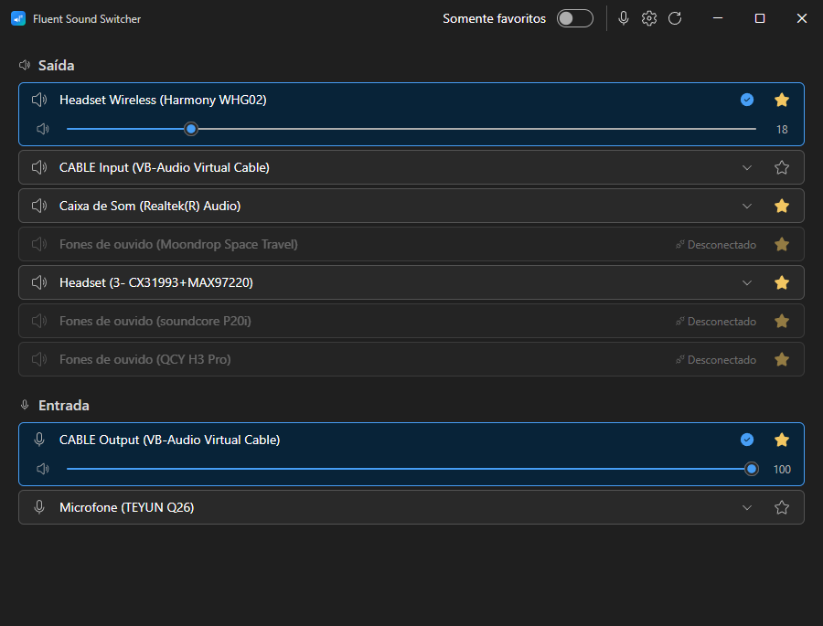
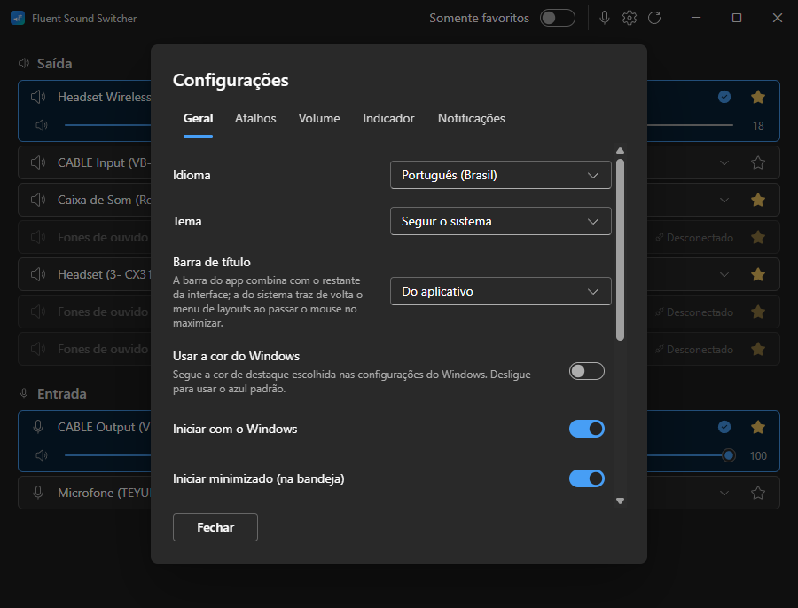
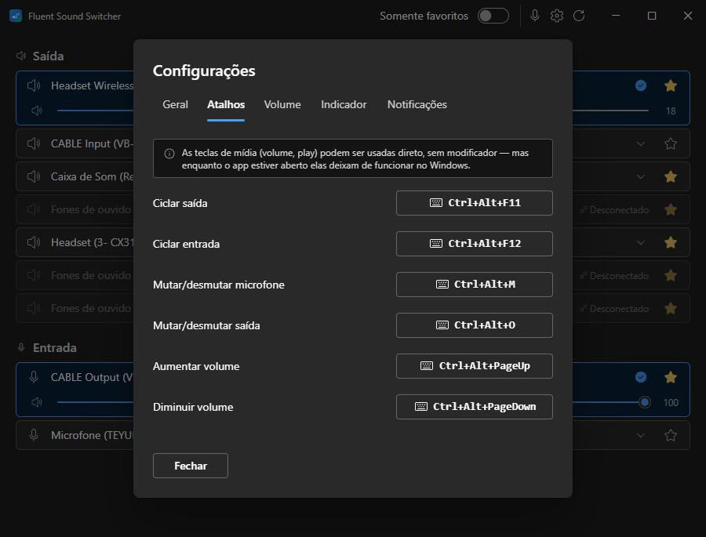

<div align="center">


# Fluent Sound Switcher

**Switch your Windows 11 audio devices instantly — with a UI that actually looks like Windows 11.**

[](https://tauri.app)
[](https://react.dev)
[](https://www.rust-lang.org)
[](https://fluent2.microsoft.design/)
[](./LICENSE)
[](https://github.com/Leocadio94/fluent-sound-switcher/releases)

</div>

A modern, lightweight alternative to [SoundSwitch](https://github.com/belphemur/soundswitch)
for Windows 11. Same core idea — quickly switch playback/recording devices and
toggle your mic — but built on [Tauri](https://tauri.app) with a native-feeling
[Fluent 2](https://fluent2.microsoft.design/) interface. It also fixes
SoundSwitch's long-standing annoyance where the on-screen popup hides **behind
the taskbar in fullscreen apps** like Steam Big Picture — our overlay renders on
top, every time.

> ⚠️ **Early development (`0.2.x`).** Functional and in daily use, polishing
> toward a 1.0. Built in phased iterations.

## 📸 Screenshots

<div align="center">



</div>

<div align="center">




</div>

## ✨ Features

- 🔁 **Switch** output/input devices from a curated favorites list (you choose which show up).
- 🔊 **Per-device volume** — a slider on the device you are using, and on any other at a click. Mute outputs as well as the mic.
- ⌨️ **Global hotkeys** — cycle output, cycle input, toggle mic mute, volume up/down, toggle output mute. Fully rebindable, media keys included.
- 🎚️ **Volume OSD** — an on-screen level that shows over fullscreen games, like the mute indicator.
- 🎙️ **Mic mute** with a configurable on-screen indicator (always / only-muted / only-live / never) and a tray icon that reflects the state.
- 🖥️ **Fullscreen-safe overlay & banner** — topmost and click-through, visible *over* fullscreen games, on the monitor you are actually looking at.
- 🟦 **Tray quick-switch flyout** (left-click) and a context menu (right-click); works over fullscreen apps.
- 🔔 **Switch notifications** — any mix of a native Windows toast, an on-screen banner, and a sound.
- 🔌 **Auto-switch on connect** *(optional)* — plug in a TV/monitor with audio and it can grab the default output.
- 🖼️ **Output-device tray icon** *(optional)* — a second tray icon mirroring the current output, using the icon Windows shows for it.
- 🧰 **CLI** with the same actions as the GUI (`list`, `switch`, `cycle`, `mute`).
- 🚀 **Start with Windows** (optionally minimized to tray).
- 🌍 **Multi-language** — **pt-BR** (default) and **en**, tray and notifications included.
- 🩺 **Log file** you can open from Settings, for when something needs reporting.
- 💾 Local config in `%APPDATA%`, no account, no telemetry.

## 📦 Install

Grab the latest installer from the [**Releases**](https://github.com/Leocadio94/fluent-sound-switcher/releases) page:

- **`.msi`** (Windows Installer) or **`.exe`** (NSIS setup) — either works.

> 🛡️ **SmartScreen note:** the binaries are not code-signed yet, so Windows
> SmartScreen may warn on first run. Click **More info → Run anyway**. (Code
> signing is on the roadmap.)

## 🎮 Usage

### Hotkeys (defaults — change them in Settings)

| Action             | Shortcut       |
| ------------------ | -------------- |
| Cycle output       | `Ctrl+Alt+F11` |
| Cycle input        | `Ctrl+Alt+F12` |
| Toggle mic mute    | `Ctrl+Alt+M`   |
| Volume up          | *(unbound)*    |
| Volume down        | *(unbound)*    |
| Toggle output mute | *(unbound)*    |

Cycling walks your favorites in order (wraps around); with no favorites set it
falls back to all active devices.

The volume actions ship unbound on purpose. You can bind a media key to them
(`VolumeUp`, `VolumeDown`, `VolumeMute`) — but a global binding takes that key
away from Windows for as long as the app is running, so it has to be your call.

If a shortcut is already owned by another app, Windows refuses to register it.
The Hotkeys tab tells you which ones did not take, instead of showing a dead
binding as if it worked.

### Tray

- **Left-click** — quick-switch flyout (favorites + mute toggle).
- **Right-click** — Open, Settings, Playback devices, toggle mute, Quit.

### Floating windows and monitors

The mute indicator, the volume OSD, the switch banner and the tray flyout all
render above fullscreen apps. By default they follow the monitor your cursor is
on — the cheapest guess at the screen you are looking at. Settings → General
lets you pin them to the primary monitor, or send them to whichever monitor
holds the focused window.

### Logs

Settings → General → **Abrir pasta de logs** opens the folder with a rotating
log file. Nothing the app prints reaches a console (it is a windowed binary), so
that file is the way to see what happened — attach it to a bug report.

### CLI

The same executable doubles as a CLI — run it with a subcommand and it performs
the action and exits without opening the GUI:

```powershell
fluent-sound-switcher list [output|input]   # list devices (id, name, * = default)
fluent-sound-switcher switch <id|name>      # set default device (matches by id or name)
fluent-sound-switcher cycle <output|input>  # cycle to the next favorite
fluent-sound-switcher mute [toggle|on|off]  # microphone mute (default: toggle)
fluent-sound-switcher --version
fluent-sound-switcher --help
```

## 🛠️ Tech stack

| Layer    | Tech                                                |
| -------- | --------------------------------------------------- |
| Shell    | Tauri v2                                             |
| Frontend | React 19 + Vite 6 + TypeScript + Fluent UI React v9  |
| Backend  | Rust + `windows` crate (Core Audio / COM)           |
| i18n     | react-i18next                                        |
| Config   | Tauri `store` plugin (`%APPDATA%/com.fluentsoundswitcher.app/config.json`) |

Switching the default device uses the undocumented `IPolicyConfig` COM interface
(the same mechanism the Windows Sound control panel uses); device-arrival
monitoring uses `IMMNotificationClient`.

## 🚀 Development

```bash
pnpm install
pnpm tauri:dev      # run the app (Vite + Rust)
pnpm tauri:build    # build installers (msi + nsis)

# what CI runs on every push and PR:
pnpm lint           # frontend typecheck (tsc --noEmit)
pnpm test           # frontend tests (vitest)
pnpm build          # frontend bundle
cargo fmt   --manifest-path src-tauri/Cargo.toml --all -- --check
cargo clippy --manifest-path src-tauri/Cargo.toml --all-targets -- -D warnings
cargo test  --manifest-path src-tauri/Cargo.toml
```

Requires Node, pnpm, and the Rust toolchain on a Windows 11 target.

## 🚢 Releases

Tagging a commit `v*` (e.g. `v0.2.0`) triggers the
[release workflow](.github/workflows/release.yml): it checks the tag against all
three version manifests, runs the CI checks, builds the Windows installers and
**publishes** (not drafts) a GitHub Release with the signed update artifacts, a
`latest.json`, release notes taken from `CHANGELOG.md`, and a `SHA256SUMS.txt`.

Auto-update is configured (`tauri-plugin-updater`). Because this repository is
public, the updater needs no token or proxy — it just fetches

```
https://github.com/Leocadio94/fluent-sound-switcher/releases/latest/download/latest.json
```

The public key is in `tauri.conf.json` and CI signs the artifacts with the
matching private key.

⚠️ The release must be **published**, and not a prerelease: GitHub excludes
drafts and prereleases from `releases/latest`, so either one makes every
client's update check 404. This is not hypothetical — `v0.1.1` and `v0.1.2` sat
as drafts and silently broke every update check until they were published, which
is why the workflow now forces the release out of draft as its own step
(`tauri-action` reuses an existing release for a tag and will not promote one).

The flow in the app:

1. A check runs at startup (silent, retried a few times while the network comes
   up at login) and on demand via the tray's **Verificar atualizações**.
2. Finding a newer version only *notifies* — a toast plus an update bar in the
   main window.
3. **Atualizar agora** downloads, installs and restarts. Installing is always
   explicit, because the Windows installer terminates the running app.

<details>
<summary>One-time maintainer setup</summary>

The release signing key is held outside the repo. Add the private key as a repo
secret so CI can sign updates (the public key is already committed):

```bash
gh secret set TAURI_SIGNING_PRIVATE_KEY < ~/.tauri/fss-updater.key
# the key was generated with an empty password, so no password secret is needed
```

To rotate the key: `pnpm tauri signer generate -w ~/.tauri/fss-updater.key -f`,
then update `plugins.updater.pubkey` in `tauri.conf.json` and re-set the secret.

</details>

> 🔏 **Code signing** (the Authenticode certificate that removes the SmartScreen
> warning) is separate and still pending — it needs a paid cert.

## 🗺️ Roadmap

| Status | Item |
| ------ | ---- |
| ✅ | Audio core — enumerate + switch default device |
| ✅ | Device list, favorites & filtering |
| ✅ | Global hotkeys |
| ✅ | Mic mute + fullscreen-safe status overlay |
| ✅ | Switch notifications (toast / banner / sound) |
| ✅ | Tray quick-switch flyout & menu |
| ✅ | Full tabbed settings + start-with-Windows |
| ✅ | CLI parity |
| ✅ | Auto-switch on connect + live external-change sync |
| ✅ | Branding, icons & distribution workflow |
| ✅ | Auto-update (Tauri updater, signed, via GitHub Releases) |
| ✅ | Logging, CI on every push/PR, and a release with checksums + notes |
| ✅ | Multi-monitor placement for the floating windows |
| ✅ | Per-device volume, output mute, volume hotkeys & OSD |
| ⏳ | Custom title bar (Windows 11 snap layouts need care) |
| ⏳ | Accent-colour theming (follow the Windows accent colour) |
| ⏳ | Code signing (Authenticode cert — removes the SmartScreen warning) |
| 🔮 | Per-app audio profiles *(experimental)* |

## 📄 License

[MIT](./LICENSE) © Gabriel Leocadio
